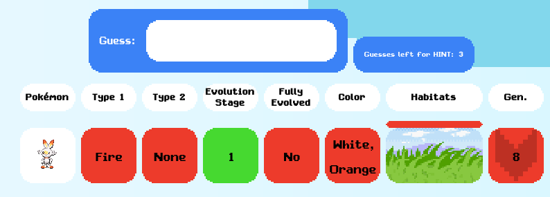
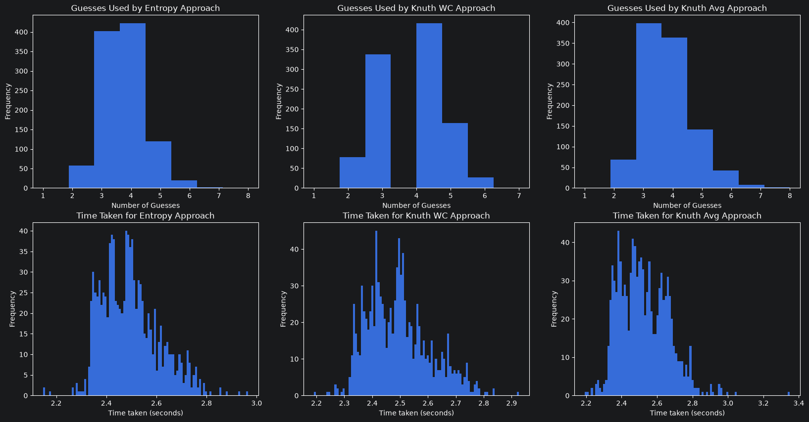
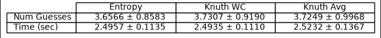

# Pokedle Solver

This repository contains some algorithms for solving Pokedle (and similar, wordle-style games) and a few experiments to
compare the algorithms. 

- [What is Pokedle](#what-is-pokedle)
- [Motivation](#motivation)
- [Algorithm Explanations](#algorithm-explanations)
  - [Experimental Comparisons](#experimental-comparisons)
- [Code Details (out of date)](#code-details)

## Next Steps
- Implement difficulty levels for a CPU v Player Pokedle match
- Look into integrating with [Pokedle](Pokedle.com)
  - I really wanna use the same data they do but I can't find the source :(

# What is Pokedle

[Pokedle](https://pokedle.com/) is a Wordle-style Pokemon guessing game. There is a hidden pokemon and you make a series of guesses to try and uncover it. For each guess you're given information on which attributes of the pokemon you guessed match the hidden pokemon, allowing you to narrow down the set of possible solutions.

Above, I've guessed Scorbunny. The game records the guess and tells me how Scorbunny's attributes compare to the hidden Pokemon's attributes.
- Red in the 'Type 1' column, Fire, indicates neither of the hidden Pokemon's types is Fire.
- Likewise, we know the Pokemon must be a dual type since 'Type 2' is red for None.
- We know the Pokemon must be a first stage evolution.
- It must be fully evolved.
- It is not classified as having either white or orange coloration.
- It is not in the grasslands habitat.
- It was introduced earlier than generation 8.

Using this information, the player continues to make guesses, narrowing down the possibilities to help identify the hidden Pokemon.
The answer here happened to be Mega Sableye.

# Motivation
One night I was playing Pokedle and came across a game state where it would be more informative to make a guess that I knew was wrong! 
I forget the exact details, so let's consider a simple, hypothetical.

Let's say you knew from previous guesses that the target Pokemon is from generation 8 and that it has one of 3 possible types: fire, grass, water.
(No gen 8 Pokemon has a combination of these three types so it must be a mono-type)
You could guess Sobble (water), Scorbunny (fire), and Grookey (grass) to determine the type of the Pokemon but in the worst case, this would take two guesses to determine the type (plus remaining guesses to find the right Pokemon of that type).
Instead, you could guess Volcanion (fire/water), ludicolo (water/grass), or scovillain (grass/fire) -- Pokemon that aren't from gen 8 and thus must not be the right answer, but that would allow you to determine the correct type in a single guess!

This prompted the following question: given a Pokedle game state, how does one determine the best guess to make? 
In an optimal play strategy would you ever find yourself making a guess known to be wrong or is a situation as described above just a result of poor guesses early on?

This repository is a result of researching that question and contains implementations for different 'optimal' Pokedle strategies.
Given a game state, any of the guessing strategies implemented allow you to determine (one of) the 'best' guesses to make at each step.

# Algorithm Explanations

First, let's examine the problem a little more formally and understand the basic principles we'll be using.

The setup is as follows, we start the game with a set of Pokemon (or 5-letter words if we're playing Wordle or
possible arrangements of colored pegs if we're playing Mastermind), we'll call this $P$.
At any given point in the game we have a set of possible answers $A \subseteq P$, these are the 'Pokemon' (or whatever)
that are consistent with the information we've gained from all our previous guesses.
We also have a set of guesses that we can make, $G \subseteq P$. Note that $G$ and $A$ aren't the same - even if you know a Pokemon isn't the
right answer, you can still guess it.
We'll assume that $G$ is all valid Pokemon (or whatever) that haven't been guessed yet.

These Pokemon (or whatever) have a binary operation, given $a, b \in P$, define $a \oplus b$ to be the result of 'comparing'
the guess $a$ to a hidden answer $b$. 
That is, in the picture below, $a$ is 'Scorbunny', $b$ is the hidden answer 'Mega Sableye' and $a \oplus b$ is the
colored diagram telling us how Scorbunny's types, evolution stage, etc. compare to Mega Sableye.

Each time we make a guess, we can eliminate some answers from $A$.
For a guess, $a$, we get a response $a \oplus b$ for a hidden $b$. We can check every possible value of $b$ and see if
it would give us the same response.
So for all $a' \in A$, if $a \oplus a' \neq a \oplus b$ we remove $a'$ from $A$.
In other words, if comparing our guess with a Pokemon doesn't give us the same response, we know that Pokemon couldn't possibly
be the answer.

Reducing the size of $A$ is a good thing - the fewer possible answers there are, the better the chance we have of finding the right one.
In fact, the best algorithms for solving these types of problems are basically centered on finding out what guess you can make that reduces 
the size of $A$ by as much as possible at each stage.

### Donald Knuth's Mastermind Algorithm

[Mastermind](https://en.wikipedia.org/wiki/Mastermind_(board_game)) is a variant of Pokedle that uses arrangements of colored pegs
instead of Pokemon. So, instead of guessing a Pokemon that has a type, evolution stage, color, etc. you guess a sequence of colored
pegs.

Donald's Knuth developed an optimal strategy to win Mastermind, find the right guess, in as few moves as possible _in the worst case_.

The idea is you look at each possible guess you could make and consider what the response would be for each of the possible answers.
This partitions the set of answers.
Let's look at just the evolution stage as an example.
Guessing a Pokemon with an evolution stage of 1 has 2 possible outcomes: either the hidden Pokemon has evolution stage 1 and I get a match
or the hidden Pokemon has an evolution stage of 2 or 3, and I get a miss.
So I can look at all my possible answers and ask, would you give me a match or a miss if I guessed an evolution stage of 1.
This partitions them into two sets, the sets of Pokemon with evolution stage 1 and of Pokemon with evolution stage 2 or 3.

In the algorithm, we're also considering types and color and generation, so the partition is more fine-grained but the idea is the same.
Each guess partitions Pokemon according to the response they'll give.
When we actually enter the guess into the game, we just check the response we get and that tells us which partition contains the
correct answer.
We keep doing this until we guess the right answer.

Back to Donald Knuth's algorithm.
We look at each guess and partition the answers, and we assign a score to each guess baed on the size of the largest partition.
This is our 'worst-case' heuristic.
The worst-case scenario is that the hidden answer is the one that leaves us with the largest set of possible answers to check afterwards.

So we calculate this worst-case score and then choose the guess that has the smallest score.
That is, choose the guess that, in the worst case, leaves us with the smallest number of answers to check.

In some situations, this worst-case heuristic is too conservative, like if the worst-case scenario is relatively unlikely.
A variant of this algorithm scores guesses based on the _average_ size of the partitions rather than the largest size. 

### Entropy Based Algorithm

[This](https://tomrocksmaths.com/wp-content/uploads/2023/07/using-information-entropy-to-e28098solve-wordle.pdf) document gives a good
overview of the entropy algorithm, in more detail than I'm going to go into here but I'll give the overview.

In Donald Knuth's algorithm, we score each guess based on how much it will reduce the size of $A$.
What if instead, we score guesses based on the amount of information they tell us?
We call the expected amount of information from a guess the 'Entropy' and look for the guess with the highest entropy.

It's the same core principle though.
We loop through each guess and partition the possible answers based on how they respond.
Using the sizes of these partitions, we can compute the expected amount of information we'll gain and assign this as the
guesses score.
Then we just choose the guess with the highest score.

### Implementation

The core implementation is the same across these three algorithms and can be found in [get_next_guess](Solver/guesser.py).
You can think of the three algorithms above as just describing how to score the guesses so we implement separate score functions for each.

## Experimental Comparisons

So which algorithm is best?

It depends!

I ran some experiments that tell us how these algorithms perform on the set of 1025 Pokemon with the particular Pokemon data I could find
and it looks like the Entropy based approach is, very loosely speaking, a little bit better, but not noticeably.

### Total Wins (Including Ties)

I determined how many times each algorithm found the right answer in the fewest number of guesses, ie: 'won'.

- Knuth Worst-Case Heuristic: 778/1025 times had the fewest number of guesses
- Knuth Average-Case Heuristic: 645/1025 times had the fewest number of guesses
- Entropy-Based Approach: 778/1025 times had the fewest number of guesses.

So about 76% of the time, Knuth WC or Shannons will find the answer in the fewest number of guesses but that doesn't really tell us much.

### Histrograms

I also built histrograms showing the distribution of how many guesses each algorithm took (and how long they took, for fun):

None of the algorithms took exceptionally long nor did they need a large number of guesses. Most of the time they just needed 3-5
guesses to get the right answer.
They also took about the same time - this isn't surprising, most of the computation is the same between the algorithms, the only change is the score function which doesn't cost much, relatively.

### Mean and St. Dev

Finally, I computed the true mean and standard deviation for the different algorithms:

The Entropy-Based approach has a lower mean and a smaller variance but there's clearly some overlap.
To put these numbers in perspective, it takes me, and I consider myself pretty knowledgeable about Pokemon, around 8 tries on average
to solve Pokedle, but I do get lucky (and very, very unlucky) occasionally.

So to answer my earlier question, choosing the 'best' guess in Pokedle depends on how you define 'best'.
Each of these algorithms optimize a different, sensible heuristic targets and, in practice, perform about the same.

# Code Details

The code was built using python.

I used a few libraries to do the statistics, matplotlib and numpy, but otherwise the algorithms and simulation code is pure python.

The different guessing strategies/optimal algorithms are implemented in [guessing_strategies.py](Solver/guesser.py).

[pokemon.py](pokemon.py) contains the classes for representing and comparing Pokemon.

Pokemon data can be found in the Data directory. [pokemon.csv](Data/pokemon.csv) contains the pokemon species encoding and
the other files decode the numeric values to strings for types, names, and colors.

[game.py](game.py) contains the code for simulating a game given an answer and a guessing strategy.

The Statistics directory contains the code/data for the experiments I ran.
